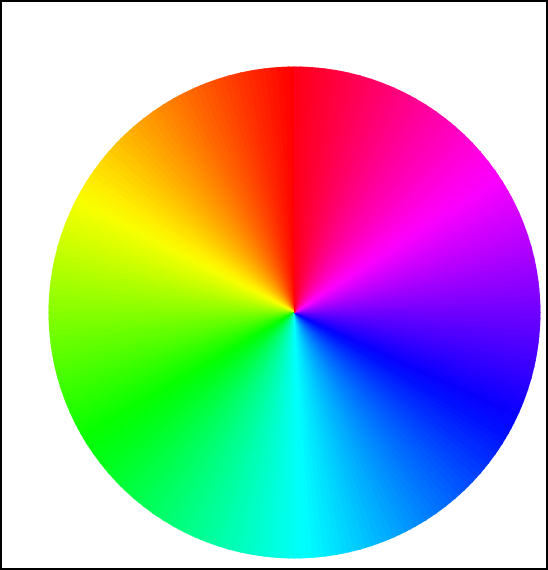
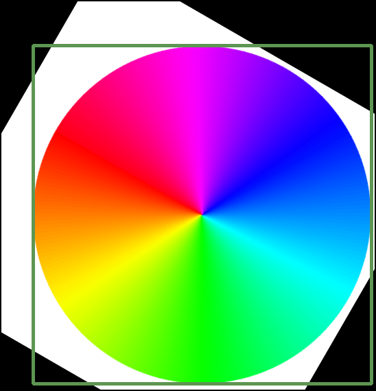
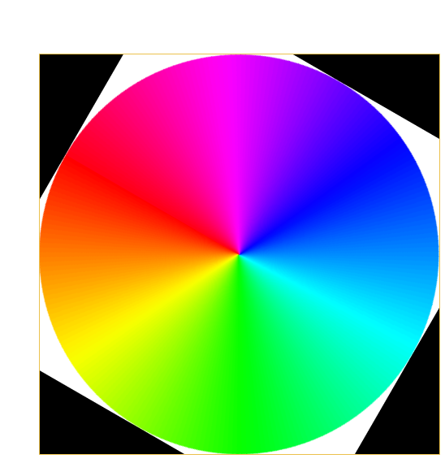

# Simple helper package for opencv
[](https://github.com/ambv/black)

cvhelper is a simpler wrapper for the opencv-python package. As mentioned package only
gives access to OpenCV functions, in a C++ style, it can be tedious to write. There is
also no support for the OpenCV classes like Rect, Point etc. cvhelper attempts to fix that.

The package is at an early state, and contributions are welcome! The contents of the package
have been a demand-and-supply model, where functionality is added as new tedious things in
opencv-python are found. Do not hesitate to file an issue, requesting new functionality or 
enhancement proposals! 

## Examples
### Reading videos
OpenCV:
```python
import cv2 as cv
video = cv.VideoCapture("path/to/file")
if not video.isOpened():
    raise ValueError("Could not open video")

while True:
    ok, frame = video.read()
    if not ok:
        break
    cv.imshow("Frame", frame)
    if cv.waitKey(0) & 0xFF == ord('q'):
        break 
video.release()
``` 

cvhelper:
```python
import cv2 as cv
import cvhelper as cvh
with cvh.load_video("path/to/file") as video:
   for frame in cvh.read_frames(video, start, stop, step):
       cv.imshow("Frame", frame)
       if cvh.wait_key(0) == ord('q'):
            break 
```

### Rotate A Color Wheel
Say we have the following color wheel image, which we want to rotate.



We of course want to rotate it at it's center, which is not in the center
of the image. A possible solution using OpenCV would be 

```python
import cv2 as cv
import random

img = cv.imread("resources/color_wheel_invert.png")
gray = cv.cvtColor(img, cv.COLOR_BGR2GRAY)
_, otsu = cv.threshold(gray, 250, 255, cv.THRESH_BINARY_INV)
_, contours, _ = cv.findContours(otsu, cv.RETR_EXTERNAL, cv.CHAIN_APPROX_SIMPLE)
contour = contours[0]
rect = cv.boundingRect(contour)  # Gives a tuple (x, y, w, h)
x, y, w, h = rect

color = [random.randint(0, 255) for _ in range(3)]

degrees = 60
center = (x + w / 2), (y + h / 2)
rotation_matrix = cv.getRotationMatrix2D(center, degrees, 1)
rotated_image = cv.warpAffine(img, rotation_matrix, gray.shape[::-1])

cv.rectangle(rotated_image, (x, y), (x + w, y + h), color)

cv.imshow("Image", rotated_image)
cv.waitKey(0)
```

We get the following result. The drawing of the rectangle is just for show. 



Although a perfectly fine solution, we cannot help but rotate the whole image.
Here is a solution using cvhelper.

cvhelper:
```python
import cv2 as cv
import cvhelper as cvh

img = cv.imread("resources/color_wheel_invert.png")
gray = cvh.bgr2gray(img)
otsu = cvh.threshold_binary(gray, 250, inverse=True)
contours = cvh.find_external_contours(otsu)
contour = contours[0]
rect = contour.bounding_rect  # Gives a Rect object
degrees = 60

center = rect.center  # Gives a Point object
top_left = rect.tl  # Gives a Point object
new_center = center - top_left 
img[rect.slice] = cvh.rotate_image(
    img[rect.slice], new_center, degrees, unit=cvh.AngleUnit.DEGREES
)
cvh.rectangle(img, rect, cvh.Color.RANDOM)

cv.imshow("Image", img)
cvh.wait_key(0)
```

With the following result



Not only is this a tad less tedious to write, but we are also able to 
rotate only the relevant part of the circle by slicing. The contour, rectangle
and point objects are also an ease to work with. 
